# Grave Consequences — Design Spec v1

*A party game that fuses Jackbox's **Trivia Murder Party** loop with the deduction spine of **Clue**. One shared host screen, everyone on their phones. Target for v1: a **polished showpiece** — a single full loop built to high fidelity.*

**Locked decisions (v1):** Name: Grave Consequences · PvE deduction race (§9) · classic Clue / Sherlock Holmes Victorian identity (§8) · trivia as swappable standalone packs (§5) · closed-world clue bounding (§5).

---

## 1. The one-sentence pitch

Everyone is a sleuth racing to solve a murder — you earn evidence by surviving a trivia gauntlet, the dead keep investigating as ghosts, and the game ends in a run-for-your-life accusation showdown.

---

## 2. Why the fusion works (design integrity)

| Genre | Strength it contributes | Weakness the other genre fixes |
|---|---|---|
| **Clue** | Deduction skill spine (not pure luck); a satisfying "aha" payoff | Can drag; eliminated players sit bored |
| **Trivia Murder Party** | Chaos, drama, stakes; ghosts keep dead players engaged | Trivia is filler ("don't die"); outcomes are luck-heavy |

The keystone move: **trivia is not a side minigame — it's how you acquire evidence.** Every question carries two stakes at once (survive *and* advance the case).

---

## 3. Core loop

```mermaid
flowchart TD
    L[Lobby: join, pick sleuth avatar] --> R[Trivia Round<br/>interrogate the scene]
    R -->|Correct answer| E[Earn Evidence<br/>reveal next clue]
    R -->|Wrong answer| K[Killing Floor<br/>chance/skill minigame]
    K -->|Survive| P[Earn a private lead]
    K -->|Die| G[Ghost<br/>still deduces, can be revived]
    E --> C{Case solvable?}
    P --> C
    G --> C
    C -->|No| R
    C -->|Yes| F[Finale: The Accusation<br/>race the Killer, name Who / What / Where]
    F --> W[First correct accusation wins]
    STRIKE[The Killer Strikes<br/>periodic: ALL players to Killing Floor] -.-> K
```

- **Correct trivia →** reveals the next **public elimination** on the shared board.
- **Wrong trivia →** the **Killing Floor**. Survivors of a real cull earn a **private lead**; the dead become **ghosts** (who keep playing and can be revived).
- **The Killer Strikes:** a periodic scripted event drags *everyone* to the Killing Floor at once.
- **Finale — The Accusation:** lock Who / What / Where while the Killer closes in; first correct accusation wins.

---

## 4. Visibility model — who sees what

Three visibility tiers, not two. The analogy is Clue exactly: the **board** (public) / your **hand of cards** (private) / the **sealed envelope** (secret) — except the envelope never leaves the server, so it's stronger than the cardboard one at the table.

| Element | Public (shared TV) | Private (your phone) | Secret (server only) |
|---|:---:|:---:|:---:|
| Crime scene + possibility grid | ● | | |
| Current trivia question + timer | ● | | |
| Your answer choice | | ● *(until reveal)* | |
| Alive / ghost roster | ● | | |
| Killing-Floor drama + who died | ● | | |
| Killer proximity (finale) | ● | | |
| Communal eliminations (cleared cards) | ● | | |
| Your personal leads | | ● | |
| Your working theory / accusation | | ● *(until you lock it)* | |
| Your lives / revival tokens / streak | | ● | |
| The sealed solution + full evidence graph | | | ● |
| Death-roll RNG | | | ● |

### The public/private evidence split
- **Public = eliminations.** "Card X is not the solution." These hit the shared corkboard for everyone — communal, dramatic, and they keep the big screen alive.
- **Private = confirmations / directional leads.** "The weapon was a poison." These go to the earner's phone alone — the asymmetric edge that lets *you* accuse a beat before the pack.

You win by being the one to lock the correct accusation first — using the public board *and* your private leads — while surviving. The public/private ratio is a v1 playtest dial.

### The three tiers ARE three Firestore security postures (already built for Hold'em)
- **Public** → room-scoped docs, readable by anyone in the lobby.
- **Private** → per-player docs; rules restrict `read` to the owner's `uid`. Your hole-cards pattern.
- **Secret** → *no* client read at all; only Cloud Functions touch the solution + full graph.

---

## 5. Content architecture — CasePacks, TriviaPacks, and the closed world

Two orthogonal content types, mixed freely. A `CasePack` holds the mystery; a `TriviaPack` holds questions. They never reference each other, so **any trivia plays with any case**.

### Bounding the option space — the closed world
Clue is solvable because it is a *closed world*: fixed candidate lists, one answer per category, and every non-answer card accounted for. Every CasePack inherits this as a hard contract:

1. **Fixed, finite candidate lists per category.** The `board` declares e.g. 6 suspects, 4 weapons, 4 rooms → a possibility space of exactly 6×4×4 = 96 candidates. Nothing off the board can ever be the answer (closed-world assumption). The accusation UI is bounded multiple choice: 1 of N / 1 of M / 1 of K.
2. **Exactly one truth per category** in the sealed `solution`.
3. **Clue *effects* are ID-sets over the board, never free text.** A clue's flavor may be property-based ("left-handed"), but its mechanical effect is always a concrete list of board IDs, pre-resolved at authoring time. The prose is a costume; the effect is finite and machine-checkable.
4. **Completeness guarantee.** The public clue set must be able to eliminate every non-solution card, so the board always narrows to one. Checked by the validator.

Only three clue effect types, all over that bounded set:

| Effect | Operates on | Tier | Result |
|---|---|---|---|
| `eliminate` | one board ID | public | removes one candidate |
| `narrow` | a set of board IDs | public or private | removes a pre-resolved subset |
| `confirm` | one board ID | private | locks the true card in a category |

For AI generation later: because effects are ID-sets over a frozen board, an over-eager model can't produce an unbounded or contradictory space. The generator fixes board + solution, writes effects as ID-sets, dresses them in narrative, and the validator rejects any pack that references an off-board ID or fails to collapse to one answer. The closed world is what makes "infinite replay" safe.

### TriviaPacks are swappable and decoupled
`TriviaPack` = `{ name, category, questions[] }`, with zero references to any story. The engine binds generically: **a correct answer dispenses the next clue from the case's queue**, regardless of which question it was. Pick packs at lobby setup; enable several for a bigger pool.
- **Rule:** the enabled trivia pool must hold at least as many questions as the case has clues to dispense (else draw across packs / recycle). The loader checks this.

### Clue dispensing
- **Public eliminations** → dispensed on **correct trivia**, in an authored, category-interleaved order so the board narrows evenly (no axis solves too early).
- **Private leads** → dispensed on **Killing-Floor survival** of a real cull — scarce edges tied to risk.

### The CasePack, split by tier at load time
- `board` → **public** Firestore room doc.
- `solution` + full `clues[]` → **secret**, server-only.
- Trivia `answerIndex` → **secret** (grade server-side).
- Earned clues get promoted to public/private as unlocked.

### Content files
- `case-ravenwood-manor.json` — the first hand-authored mystery; doubles as the generator schema; ships with a `validation` block of solvability invariants (the future "validated detector").
- `trivia-pack-general-knowledge.json` — a standalone example pack, fully decoupled.

> **Landlord test — passed.** Generation is a build-time job; the live game calls zero model APIs. The model manufactures an asset you keep.

---

## 6. Tech stack (reuse what you built for Hold'em)

| Piece | Role | Notes |
|---|---|---|
| **Firebase Hosting** | Host view + player view | Static front-end (served next to Functions/Auth); live at grave-consequences.web.app |
| **Firestore** | Realtime room state | Players, phase, question, revealed evidence, ghost status |
| **Cloud Functions** | Authoritative logic | Question selection, answer grading, clue dispensing, death rolls, solution checking |
| **Firestore Security Rules** | Hidden information | Solution + un-revealed evidence server-side only |
| **Firestore / Storage** | Content library | CasePacks + TriviaPacks, owned |

The core risk — the answer can't live in the browser or players cheat — is the exact hole-cards problem you cracked for Hold'em. Same Blaze-plan requirement applies.

---

## 7. v1 scope — the vertical slice

Depth-first: build *one* full loop end-to-end at high fidelity, then widen.

**v1 includes exactly one of each, polished:** lobby (with **trivia-pack selection**) → 1 trivia round type → **1** Killing-Floor minigame → evidence flowing onto the corkboard → **The Accusation** finale · **1 hand-authored CasePack** + **1 TriviaPack** · ghost state + one resurrection path · the corkboard host-screen theater (§8).

**Deferred to v2+:** the AI pack generator, additional minigames, the traitor mode (§9), cosmetics.

---

## 8. What "polished" means here (so it's a target, not a vibe)

- **Identity: classic Clue / Sherlock Holmes — Victorian.** Gaslit country-manor whodunit: oxblood and brass, deep greens, aged parchment, a serif display face, hansom-cab-and-fog atmosphere. Ravenwood Manor, 1872. Commit fully.
- **The host screen is the detective's corkboard.** It retains a **Clue-style manor map** — a high-level floorplan of the house and grounds, rooms as regions — as the centerpiece. Suspect portrait cards line the top, weapon cards the bottom. **Notes push-pin onto the board**, joined to the map and suspects by **red string**, and cards get a **"cleared" stamp** as evidence eliminates them. It updates live as the room plays.
- **Juice.** Evidence-reveal stamp, Killing-Floor tension audio, the accusation drumroll, a Killer-closing-in heartbeat.
- **Frictionless lobby.** Room code, avatar pick, pack selection, zero-instruction join.

---

## 9. Murderer fork — RESOLVED: PvE

- **PvE deduction race (chosen for v1).** The solution is the game's hidden envelope; everyone races to deduce it. Cleanest to build and polish, no role-balancing.
- **Traitor mode (documented v2 toggle).** One player is secretly the murderer. Changes exactly *one* row of the §4 visibility model — a private "you're the killer" channel plus private sabotage actions. Everything else holds identically.

---

## 10. Name candidates

| Name | Why |
|---|---|
| Postmortem | Death + the engineer's "postmortem" double meaning |
| **Dead Reckoning** | Navigation term (nods to your background) + "reckoning" |
| **Rest in Pieces** | Leans into the party-game humor |
| **Grave Consequences** *(chosen)* | Does what it says on the tombstone |

---

## 11. Next actions

1. ~~Lock the fork~~ → **PvE** ✓
2. ~~Pick the aesthetic~~ → **Victorian Clue/Sherlock** ✓
3. ~~CasePack schema + Case #1~~ → **`case-ravenwood-manor.json`** ✓
4. ~~Decouple trivia into swappable packs~~ → **`trivia-pack-general-knowledge.json`** ✓
5. **Stand up the vertical-slice skeleton** on your Hold'em plumbing: room/phase state machine first, then the content loader (CasePack + selected TriviaPack) with the tier split + validator, then one round, one minigame, finale.
6. **Build the corkboard host view** — manor map + pinned notes + red string + cleared stamps.

---

*Spec owned by you. React and cut freely.*
